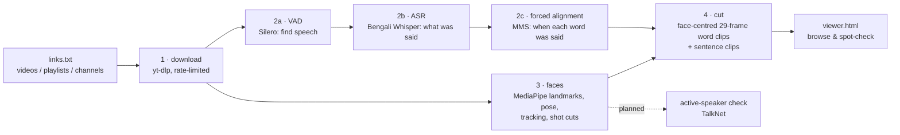

# bengali-vsr-dataset

A pipeline that builds a **Bengali lip-reading (visual speech recognition) dataset from YouTube videos**,
in the style of [Lip Reading in the Wild (LRW)](https://www.robots.ox.ac.uk/~vgg/data/lip_reading/lrw1.html)
for single words and LRS3 for sentences.

Give it a list of YouTube links. It downloads the videos, works out which Bengali word is spoken
when, and cuts a short clip around each word, with the word's exact timing stored next to the clip.

> **Status: v0.2 (work in progress).** Downloading, transcription, word alignment, face tracking
> and face-centred clip cutting work and have been tested end to end. The active-speaker check,
> vocabulary selection and train/val/test splits are not built yet. Until the active-speaker check
> exists, clips with more than one face on screen are rejected. See [Roadmap](#roadmap).

---

## Why

Most lip-reading datasets are English (LRW, LRS2, LRS3). Other languages have their own versions:
Mandarin (LRW-1000), Arabic (LRW-AR), Persian (LRW-Persian). Bengali has very little.

Our previous work, *A Transfer Learning Framework for Cross-Script Visual Speech Recognition*
(BRAC University, 2025), reached 79.77% accuracy on LRW-AR but only 45.83% on LipBengal, and
pointed to the lack of Bengali training data as the main cause.

The existing Bengali lip-reading datasets are recorded, prompted speech:
- **BenAV** (2021): 50 words, 128 speakers.
- **LipBengal** (2025): 150 students of one institution, 92% male, recorded on phone cameras.

The large multilingual MultiVSR corpus (2025) covers 13 languages and does not include Bengali.
As far as we found, no word-level Bengali lip-reading dataset of natural, in-the-wild speech
exists. This project builds the tooling to create one. The checks behind this claim and what is
still unverified are in [docs/RESEARCH_LOG.md](docs/RESEARCH_LOG.md) §7.

[docs/RESEARCH_LOG.md](docs/RESEARCH_LOG.md) records every design decision with its reason, all measurements, the verification done and open issues; it is the reference for the paper. [PLAN.md](PLAN.md) has the full research background: how LRW, LRS3, LRW-1000, LRW-AR and
LRW-Persian were built, the tool choices, size estimates and YouTube rate limits.

---

## How it works



### Stage 1: Download (`bvsr.download`)
- **expand:** turns each link (a video, a playlist or a channel's `/videos` page) into a list of
  videos in `data/manifest.jsonl`. It skips live streams, Shorts and videos outside the duration limits.
- **fetch:** downloads each video with [yt-dlp](https://github.com/yt-dlp/yt-dlp).
  - Picks **H.264 at ≤720p**, which face tools read reliably.
  - Saves human-made Bengali subtitles when they exist.
  - Extracts a **16 kHz mono wav** for the speech models.
- **Stays within YouTube's limits:**
  - waits 10–20 s between videos and 0.75 s between requests (yt-dlp's own `-t sleep` preset);
  - downloads at most 150 videos per rolling hour, half of YouTube's ~300/hour limit for logged-out use;
  - on "Sign in to confirm you're not a bot" or HTTP 429, waits longer each time (30 min, 60 min, …);
  - keeps a download archive, so a stopped run resumes where it left off.

### Stage 2: Transcribe and align (`bvsr.transcribe`)
Two phases. Only one large model is in memory at a time, so it runs on an 8 GB laptop.

| Step | Model | What it does |
|---|---|---|
| VAD | [Silero VAD](https://github.com/snakers4/silero-vad) | Finds the parts with speech and groups them into chunks of ≤20 s. Silence and music are skipped, which stops Whisper from inventing text. |
| ASR | [`bengaliAI/tugstugi_bengaliai-asr_whisper-medium`](https://huggingface.co/bengaliAI/tugstugi_bengaliai-asr_whisper-medium) | Bengali speech-to-text: *what* was said in each chunk. Loaded in fp16 on GPU/Apple Silicon. Human subtitles can be used instead (`--use-subs`). |
| Alignment | [MMS forced aligner](https://huggingface.co/MahmoudAshraf/mms-300m-1130-forced-aligner) via [`ctc-forced-aligner`](https://github.com/MahmoudAshraf97/ctc-forced-aligner) | Given the audio and the text, finds *when* each word starts and ends. Bengali is first romanised with uroman. Each word gets a confidence score. |

Example on a test sentence (macOS Bengali text-to-speech, our own text):

| word | start (s) | end (s) | score |
|---|---|---|---|
| আমি | 0.04 | 0.24 | −0.06 |
| বাংলাদেশে | 0.34 | 1.20 | −0.25 |
| থাকি | 1.28 | 1.60 | −0.08 |
| আজকে | 1.94 | 2.28 | −0.02 |
| আবহাওয়া | 2.38 | 2.90 | −0.75 |
| **যা** | 2.92 | 3.00 | **−3.98** |

`যা` was never spoken; Whisper invented it. The aligner gives it a very low score, so the default
filter (`--min-score -1.0`) drops it. The score is the mean log-probability per word: 0 means certain,
more negative means less certain.

### Stage 3: Faces (`bvsr.faces`)
The video is decoded once on a **25 fps grid**: frame *i* is the picture at *i*/25 s. Each frame gets:

| Measurement | How |
|---|---|
| Face landmarks (478 points) | [MediaPipe Face Landmarker](https://developers.google.com/edge/mediapipe/solutions/vision/face_landmarker) (FaceMesh-V2), up to 4 faces per frame |
| Head pose (pitch, yaw, roll) | from MediaPipe's facial transformation matrix. Checked on real footage: yaw follows the nose's sideways offset within the face outline (r = 0.86, same sign). |
| Face tracks | greedy box-overlap (IoU ≥ 0.3) tracker; a track ends after 2 missed frames |
| Shot cuts | colour-histogram distance between consecutive frames (Bhattacharyya > 0.35), as in the LRW pipeline. Tracks never continue across a cut. |
| Mouth sharpness | variance of the Laplacian over the mouth region, rescaled to 96 px |

The two cut signals complement each other. In the test video, cuts to a different scene or a flash
transition scored 0.42–0.99. Zoom cuts within the same scene scored only 0.12–0.17, below the
threshold, but the tracker breaks there because the face box jumps. Normal frames scored at most
about 0.21 (99.9th percentile).

Runs on the CPU at about 4× real time per worker (a 3:53 video takes about 60 s, ~300 MB RAM).
`--workers N` processes several videos in parallel.

### Stage 4: Cut clips (`bvsr.cut`)
Clips are rendered from the same 25 fps frames that stage 3 measured. So frame *k* of a clip is
exactly video frame `frame_start + k`, its stored landmarks were measured on that frame, and its
audio is the matching 640-sample slices (1/25 s at 16 kHz) of the wav.

- **Word clips (LRW style):** **29 frames at 25 fps (1.16 s), 256×256**, centred on the middle of the word.
  The official LRW sample clip has exactly this format: 256×256, 25 fps, 29 frames, 16 kHz mono AAC.
  - Spoken words are shorter than that (median 0.24 s, about 6 frames, in our test).
  - So each clip also contains part of the words before and after. **This is deliberate and matches LRW.** Models get a fixed-length input, and lip movement that starts before or continues after the word is kept.
  - The metadata records which frames contain the word, so a model can mask or trim the rest.
  - At most 5 clips of the same word come from one video, to keep speakers varied.
- **Face-centred crop:** a square crop centred on the nose tip. The centre is smoothed over 5 frames. The size is 1.6 × the face's landmark extent and stays constant within a clip. This matches the official LRW sample: measured with the same landmarker, its face fills 0.616 of the crop (scale 1.62) with the nose at the centre, against 0.62–0.635 for our clips. The LRW paper describes the crop as mouth-centred, but in its sample the mouth sits below centre, at y = 0.61. Parts of the crop outside the frame are filled with black, and that fraction is recorded.
- **Quality filters.** A candidate is rejected, and logged with the reason, if:

  | reason | rule (default) |
  |---|---|
  | `shot_cut` / `track_break` | the clip crosses a shot cut, or one face track does not cover the whole clip |
  | `unstable_frames` | a frame-to-frame change above 0.25 inside the clip (fades, flashes) |
  | `face_missing` | the face is missing on more than 2 of 29 frames (missing frames are interpolated) |
  | `multiple_faces` | another face is seen on ≥3 frames; fewer is treated as a false detection |
  | `small_face` | face narrower than 100 px in the source frame (LRW-Persian uses 100 px) |
  | `yaw` / `pitch` | head turned more than 30° / tilted more than 40° on any frame (LRW-Persian limits) |

- **Sentence clips (LRS3 style):** one clip per speech chunk, **224×224**, with the same filters. Pose is measured as the 95th percentile, and up to 5% missing face frames are allowed.
- **stats:** counts how often each word appears (`data/word_counts.tsv`). Used to choose the vocabulary.

### Viewer (`bvsr.viewer`)
Writes `data/viewer.html`, a local page to browse the clips:
- word clips grouped by word, each with its timing, score and largest head turn;
- sentence clips where clicking a word plays just that word;
- low-confidence words shown in red.

The page links to the clips on disk; nothing is uploaded.

---

## Output format

```
data/
├── manifest.jsonl                         one line per video: id, title, channel, duration, source link
├── download_log.jsonl                     download status per video (ok / unavailable / rate_limited / error)
├── raw/<video>/<video>.mp4 | .wav | .info.json | .bn.vtt
├── asr/<video>.json                       speech chunks + ASR text (phase 1)
├── align/<video>.json                     chunks + every word with start, end, score (phase 2)
├── faces/<video>.npz | .json               per-frame landmarks, pose, tracks, shot cuts (stage 3)
├── word_counts.tsv                        word, number of clips, number of videos
└── clips/
    ├── words/<word>/<video>_<frame>.mp4   29 frames @ 25 fps, 256x256, face centred, word in the middle
    ├── words/<word>/<video>_<frame>.json  timing + face metadata (below)
    ├── words/<word>/<video>_<frame>.npz   per-frame landmarks and crop boxes (below)
    ├── sentences/<video>/<n>.mp4          224x224 face-centred sentence clip
    ├── sentences/<video>/<n>.json | .txt  transcript + per-word timings (JSON and LRS3-style text)
    ├── summary_words.json                 how many candidates were kept / rejected and why
    └── rejects_words.jsonl                every rejected candidate with its reason and measurements
```
`<frame>` is the clip's first frame on the video's 25 fps grid.

**Word clip metadata** (`.json` next to each clip). A real example, with comments added:
```json
{
  "word": "আমার",              // normalised label (folder name)
  "surface": "আমার",            // word as transcribed
  "video_id": "4jrdEHp5afY",
  "fps": 25, "n_frames": 29, "size": 256,
  "frame_start": 16,            // first clip frame on the video's 25 fps grid
  "frame_end": 44,
  "clip_start": 0.64,           // seconds on the audio/alignment timeline
  "clip_end": 1.8,
  "word_start": 1.06,           // word boundaries from the aligner, seconds
  "word_end": 1.3,
  "duration": 0.24,
  "start_frame": 11,            // clip frames whose time falls inside the word (inclusive, 0-based)
  "end_frame": 16,
  "align_score": -0.1509,       // aligner confidence (mean log-probability; 0 = certain)
  "transcript_source": "asr",   // "asr" or "subs" (human subtitles)
  "face": {
    "track": 0, "missing_frames": 0, "other_faces": 0, "interpolated_frames": 0,
    "face_width_min": 217.2, "face_width_median": 219.5,     // px in the source frame
    "yaw_abs": 19.8, "pitch_abs": 2.9, "roll_abs": 11.2,     // largest |angle| in the clip, degrees
    "sharpness_median": 152.1, "frame_change_max": 0.127,
    "crop_scale": 1.6, "pad_fraction_max": 0.0
  }
}
```

**Per-frame arrays** (`.npz` next to each clip):

| array | shape | meaning |
|---|---|---|
| `landmarks` | (29, 478, 2) float16 | MediaPipe face-mesh points in **clip pixel coordinates**, so a mouth crop can be taken without detecting the face again |
| `crop_box` | (29, 3) float32 | crop centre x, centre y and side length in **source-video pixels**, to recreate the crop from the original video |
| `interpolated` | (29,) bool | frame's landmarks were interpolated because the face was not detected |

**Sentence clips** have a `.json` with the same fields as word clips plus `text` and a `words` list
(each word's start/end in seconds from the clip start, its frame range and score), and an
LRS3-style `.txt`:
```
Text:  <full transcript of the chunk>
Conf:  -0.38

WORD START END SCORE
<word> 0.08 0.48 -0.099
...
```

**Labels** are normalised so that one word always maps to one class: Unicode NFC, zero-width
characters removed, punctuation (danda etc.) removed, Bengali letters only.

**Timing and precision.** The video is resampled to a 25 fps grid. Video frame *i* is at time
*i*/25 + `offset`, where `offset` is the video stream's start minus the audio stream's start (read
with ffprobe, stored in `data/faces/<video>.json`, 0 for the test video). The aligner works in 20 ms
steps and frames are 40 ms apart, so word boundaries are accurate to about one frame. Source videos
are often ~30 fps, so grid frames do not map one-to-one to source frames; times in seconds do.

---

## Results so far

Tested on one Bengali talking-head video (3:53, one speaker, studio setting) on an Apple M2 MacBook
with 8 GB RAM:

| | |
|---|---|
| ASR + alignment | 66 s (51 s ASR, 7 s alignment, plus model loading), peak ~2.2 GB RAM |
| Faces (stage 3) | ~60 s, ~300 MB RAM; a face on 5,562 of 5,834 frames (95%) |
| Words aligned | 569 (521 pass the confidence filter) |
| Word clips | 470 candidates → **386 face-centred clips**. Rejected: 39 head turn > 30°, 26 per-video cap, 10 shot cut, 5 track break, 3 face missing, 1 video edge. ~50 s, ~210 MB RAM |
| Sentence clips | 15 candidates → **8 clips**. Rejected: 5 shot cut / track break, 1 head turn, 1 low alignment score |

Checks done:
- **40 random word clips:** all 256×256, exactly 29 frames, audio exactly 1.160 s.
- **Landmarks drawn back onto the clip frames:** the lip points sit on the lips and the nose-tip point on the nose in every frame, so the stored coordinates match the pixels.
- **Shot cuts:** the cuts found were checked by eye (zoom changes and a flash transition); a one-frame false "face" on the speaker's hands is ignored by the ≥3-frame rule.

What we saw:
- In the clips we inspected, the lips move on the frames marked as the word.
- Most words get high aligner confidence: median score −0.14, with 90% of words above −0.86.
- **English loanwords**, which are common in casual Bengali, are sometimes transcribed wrongly, so the ASR labels need a human check before release.
- One video gives too few repeats per word to build a vocabulary. That needs hundreds of videos.
- This video is edited with frequent zoom cuts, so many long sentence chunks cross a cut. LRS splits
  sentences at cuts instead of dropping them; that is a planned improvement.

---

## Setup

Tested with Python 3.12, yt-dlp 2026.8.19, torch 2.14, transformers 5.17, macOS on Apple Silicon.
Use `--device cuda` on an NVIDIA GPU.

```bash
# system tools: ffmpeg for audio/video, deno because yt-dlp needs a JavaScript runtime for YouTube (since 2025.11)
brew install ffmpeg deno          # Linux: apt install ffmpeg + https://deno.land

git clone https://github.com/Animesh6096/bengali-vsr-dataset.git
cd bengali-vsr-dataset
python3 -m venv .venv
.venv/bin/pip install -r requirements.txt
```

Download the MediaPipe face model (3.8 MB) once:
```bash
mkdir -p models
curl -L -o models/face_landmarker.task \
  https://storage.googleapis.com/mediapipe-models/face_landmarker/face_landmarker/float16/latest/face_landmarker.task
```
The file we tested with has SHA-256 `64184e229b263107bc2b804c6625db1341ff2bb731874b0bcc2fe6544e0bc9ff`.
Each run records the hash in `data/faces/<video>.json`.

The first transcription run downloads the ASR model (~3 GB) and the aligner (~1.2 GB) from Hugging Face.

MediaPipe is pinned to 0.10.35: version 1.0.x aborts on macOS even with the CPU delegate.

## Usage

```bash
# 1. put links in a text file (one per line; see links/example_links.txt).
#    Which videos to pick, copyright, candidate channels: docs/SOURCES.md, links/candidate_channels.txt
.venv/bin/python -m bvsr.download expand links/my_links.txt --tag news
.venv/bin/python -m bvsr.download fetch --max-videos 20

# 2. transcribe + align (GPU / Apple Silicon)
.venv/bin/python -m bvsr.transcribe                    # add --device cuda on a GPU

# 3. faces (CPU) - can run at the same time as step 2 on other videos
.venv/bin/python -m bvsr.faces --workers 4

# 4. look at word frequencies, then cut clips
.venv/bin/python -m bvsr.cut stats
.venv/bin/python -m bvsr.cut words                     # or --vocab file.txt to cut only chosen words
.venv/bin/python -m bvsr.cut sentences

# browse the result
.venv/bin/python -m bvsr.viewer && open data/viewer.html
```

Every stage can be resumed. Finished videos are skipped when a stage runs again.

### Main options

| Command | Option | Default | Meaning |
|---|---|---|---|
| `download expand` | `--min-duration` / `--max-duration` | 60 s / 3 h | keep videos in this length range |
| | `--max-per-link` | 50 | newest videos taken from each channel/playlist link |
| `download fetch` | `--per-hour` | 150 | max videos per rolling hour |
| | `--sleep-min` / `--sleep-max` | 10 / 20 s | random wait between videos |
| | `--max-height` | 720 | max video resolution |
| | `--cookies-from-browser` | off | use a logged-in session (use a **dedicated** account; yt-dlp warns accounts can be banned) |
| `transcribe` | `--device` | auto | `cuda`, `mps` or `cpu` |
| | `--phase` | all | `asr`, `align` or `all` |
| | `--use-subs` | off | prefer human Bengali subtitles over ASR |
| | `--asr-batch` | 2 | chunks per ASR pass; raise on a GPU |
| `faces` | `--workers` | half the CPU cores (max 4) | videos in parallel |
| | `--cut-threshold` | 0.35 | histogram distance that marks a shot cut |
| `cut words` / `stats` | `--min-score` | −1.0 | drop words the aligner is unsure of |
| | `--min-dur` / `--max-dur` | 0.12 / 1.0 s | word length range |
| | `--max-per-video` | 5 | clips of one word per video |
| `cut words` / `sentences` | `--min-face` | 100 px | smallest face width allowed |
| | `--max-yaw` / `--max-pitch` | 30° / 40° | largest head turn / tilt allowed |
| | `--crop-scale` | 1.6 | crop size relative to the face |
| | `--allow-multi-face` | off | keep clips with other faces (only once active-speaker detection exists) |
| | `--clean` | off | delete existing clips of these videos before cutting |
| `cut sentences` | `--max-len` | 20 s | longest sentence clip |

Run any command with `--help` for the full list.

---

## Roadmap

| # | Stage | Status |
|---|---|---|
| 1 | Download from YouTube, rate-limited and resumable | ✅ done |
| 2 | VAD → Bengali ASR → word-level forced alignment | ✅ done |
| 3a | Face landmarks, head pose, tracking, shot-cut detection, quality filters, **face-centred clips** with landmarks | ✅ done |
| 3b | **Active-speaker check** (is the visible face the one speaking?), e.g. TalkNet; until then multi-face clips are rejected | ⏳ next |
| 4 | LRW-style word clips and LRS-style sentence clips | ✅ done |
| 4b | Split long sentences at shot cuts instead of rejecting them | planned |
| 5 | Vocabulary selection (e.g. 500 words × ≥200 clips) | planned |
| 6 | Speaker- or channel-disjoint train/val/test splits | planned |
| 7 | Human verification of labels (at least the test set) | planned |
| — | Mouth-ROI cropping (96×96, grayscale) | separate **preprocessing** tool, not part of the dataset; LRW does not ship mouth crops either |

---

## Data and responsible use

- This repository contains **code only**. Downloaded videos, transcripts and clips stay in `data/`, which git ignores. The footage belongs to its creators.
- When the dataset is released, the plan is to follow VoxCeleb and AVSpeech: publish **YouTube IDs, timestamps and labels**, not the videos. Clips would be shared only on request for research, with a takedown contact.
- Faces and voices are personal data, so university ethics approval is needed before release.
- The downloader keeps well under YouTube's rate limits on purpose. It does not use proxy rotation or multiple accounts to get around blocks.

## Project structure

```
bvsr/
├── common.py       paths, ffmpeg helpers, Bengali text normalisation
├── download.py     stage 1: links → manifest → downloads
├── transcribe.py   stage 2: VAD → ASR → forced alignment
├── faces.py        stage 3: landmarks, head pose, face tracks, shot cuts
├── cut.py          stage 4: face-centred word / sentence clips, filters, word statistics
└── viewer.py       local HTML viewer for spot-checking
links/              example link lists
PLAN.md             research background, roadmap
docs/RESEARCH_LOG.md  decisions + rationale, measurements, verification, open issues, paper notes
docs/SOURCES.md     how to choose videos, copyright tiers, candidate channels, vocabulary plan
CLAUDE.md           instructions for AI-assisted work sessions on this repo
```

## Related datasets

- **LRW**: Chung & Zisserman, *Lip Reading in the Wild*, ACCV 2016.
- **LRS3**: Afouras, Chung & Zisserman, *LRS3-TED*, 2018.
- **LRW-1000 / CAS-VSR-W1k**: Yang et al., FG 2019.
- **LRW-AR**: https://crns-smartvision.github.io/lrwar/
- **LRW-Persian**: arXiv:2510.22716, 2025.
- **LipBengal**: Sahed et al., *Data in Brief* 58:111254, 2025, doi:10.1016/j.dib.2024.111254.

## License

The code is MIT licensed (see [LICENSE](LICENSE)). The license covers this code only. It does not
cover any video, audio or data the code downloads or produces.
