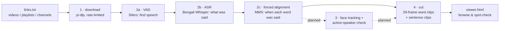

# bengali-vsr-dataset

A pipeline that builds a **Bengali lip-reading (visual speech recognition) dataset from YouTube videos**,
in the style of [Lip Reading in the Wild (LRW)](https://www.robots.ox.ac.uk/~vgg/data/lip_reading/lrw1.html)
for single words and LRS3 for sentences.

Give it a list of YouTube links. It downloads the videos, works out which Bengali word is spoken
when, and cuts a short clip around each word, with the word's exact timing stored next to the clip.

> **Status: v0.1 (work in progress).** Downloading, transcription, word alignment and clip cutting
> work and have been tested end to end. Face tracking, the active-speaker check, vocabulary
> selection and train/val/test splits are not built yet. See [Roadmap](#roadmap).

---

## Why

Most lip-reading datasets are English (LRW, LRS2, LRS3). Other languages have their own versions:
Mandarin (LRW-1000), Arabic (LRW-AR), Persian (LRW-Persian). Bengali has very little.

Our previous work, *A Transfer Learning Framework for Cross-Script Visual Speech Recognition*
(BRAC University, 2025), reached 79.77% accuracy on LRW-AR but only 45.83% on LipBengal. The main
cause was a lack of data: LipBengal has about 20 samples per word, against about 85 in LRW-AR, and
was recorded in controlled conditions. No public Bengali dataset is word-level, in-the-wild and
large scale. This project builds the tooling to create one.

[PLAN.md](PLAN.md) has the full research background: how LRW, LRS3, LRW-1000, LRW-AR and
LRW-Persian were built, the tool choices, size estimates and YouTube rate limits.

---

## How it works



### Stage 1: Download (`bvsr.download`)
- **expand:** turns each link (a video, a playlist or a channel's `/videos` page) into a list of
  videos in `data/manifest.jsonl`. It skips live streams, Shorts and videos outside the duration limits.
- **fetch:** downloads each video with [yt-dlp](https://github.com/yt-dlp/yt-dlp).
  - Picks **H.264 at ≤720p**, which face tools read reliably.
  - Saves human-made Bengali subtitles when they exist.
  - Extracts a **16 kHz mono wav** for the speech models.
- **Stays within YouTube's limits:**
  - waits 10–20 s between videos and 0.75 s between requests (yt-dlp's own `-t sleep` preset);
  - downloads at most 150 videos per rolling hour, half of YouTube's ~300/hour limit for logged-out use;
  - on "Sign in to confirm you're not a bot" or HTTP 429, waits longer each time (30 min, 60 min, …);
  - keeps a download archive, so a stopped run resumes where it left off.

### Stage 2: Transcribe and align (`bvsr.transcribe`)
Two phases. Only one large model is in memory at a time, so it runs on an 8 GB laptop.

| Step | Model | What it does |
|---|---|---|
| VAD | [Silero VAD](https://github.com/snakers4/silero-vad) | Finds the parts with speech and groups them into chunks of ≤20 s. Silence and music are skipped, which stops Whisper from inventing text. |
| ASR | [`bengaliAI/tugstugi_bengaliai-asr_whisper-medium`](https://huggingface.co/bengaliAI/tugstugi_bengaliai-asr_whisper-medium) | Bengali speech-to-text: *what* was said in each chunk. Loaded in fp16 on GPU/Apple Silicon. Human subtitles can be used instead (`--use-subs`). |
| Alignment | [MMS forced aligner](https://huggingface.co/MahmoudAshraf/mms-300m-1130-forced-aligner) via [`ctc-forced-aligner`](https://github.com/MahmoudAshraf97/ctc-forced-aligner) | Given the audio and the text, finds *when* each word starts and ends. Bengali is first romanised with uroman. Each word gets a confidence score. |

Example on a test sentence (macOS Bengali text-to-speech, our own text):

| word | start (s) | end (s) | score |
|---|---|---|---|
| আমি | 0.04 | 0.24 | −0.06 |
| বাংলাদেশে | 0.34 | 1.20 | −0.25 |
| থাকি | 1.28 | 1.60 | −0.08 |
| আজকে | 1.94 | 2.28 | −0.02 |
| আবহাওয়া | 2.38 | 2.90 | −0.75 |
| **যা** | 2.92 | 3.00 | **−3.98** |

`যা` was never spoken; Whisper invented it. The aligner gives it a very low score, so the default
filter (`--min-score -1.0`) drops it. The score is the mean log-probability per word: 0 means certain,
more negative means less certain.

### Stage 4: Cut clips (`bvsr.cut`)
- **Word clips (LRW style):** **29 frames at 25 fps (1.16 s)**, centred on the middle of the word.
  - Spoken words are shorter than that (median 0.24 s, about 6 frames, in our test).
  - So each clip also contains part of the words before and after. **This is deliberate and matches LRW.** Models get a fixed-length input, and lip movement that starts before or continues after the word is kept.
  - The metadata records which frames contain the word, so a model can mask or trim the rest.
  - At most 5 clips of the same word come from one video, to keep speakers varied.
- **Sentence clips (LRS3 style):** one clip per speech chunk, with a text file listing every word and its timing.
- **stats:** counts how often each word appears (`data/word_counts.tsv`). Used to choose the vocabulary.

### Viewer (`bvsr.viewer`)
Writes `data/viewer.html`, a local page to browse the clips:
- word clips grouped by word, each with its timing and score;
- sentence clips where clicking a word plays just that word;
- low-confidence words shown in red.

The page links to the clips on disk; nothing is uploaded.

---

## Output format

```
data/
├── manifest.jsonl                         one line per video: id, title, channel, duration, source link
├── download_log.jsonl                     download status per video (ok / unavailable / rate_limited / error)
├── raw/<video>/<video>.mp4 | .wav | .info.json | .bn.vtt
├── asr/<video>.json                       speech chunks + ASR text (phase 1)
├── align/<video>.json                     chunks + every word with start, end, score (phase 2)
├── word_counts.tsv                        word, number of clips, number of videos
└── clips/
    ├── words/<word>/<video>_<ms>.mp4      29 frames @ 25 fps, word centred
    ├── words/<word>/<video>_<ms>.json     timing metadata (below)
    └── sentences/<video>/<n>.mp4 + .txt   sentence clip + per-word timings
```

**Word clip metadata** (`.json` next to each clip):
```json
{
  "word": "আবার",            // normalised label (folder name)
  "surface": "আবার",          // word as transcribed
  "video_id": "4jrdEHp5afY",
  "word_start": 121.13,       // word start, seconds in the original video
  "word_end": 121.31,         // word end, seconds in the original video
  "clip_start": 120.64,       // where the clip was cut, seconds in the original video
  "duration": 0.18,           // word length in seconds
  "score": -0.1798,           // aligner confidence
  "start_frame": 12,          // first frame of the clip that contains the word (0-based, of 29)
  "end_frame": 17             // last frame of the clip that contains the word
}
```

**Sentence clip text file** (`.txt`). Times are seconds from the start of the clip:
```
Text:  <full transcript of the chunk>
Conf:  -0.38
Source: asr

WORD START END SCORE
<word> 0.08 0.48 -0.099
...
```

**Labels** are normalised so that one word always maps to one class: Unicode NFC, zero-width
characters removed, punctuation (danda etc.) removed, Bengali letters only.

**Precision:** the aligner works in 20 ms steps, and clip frames are 40 ms (25 fps), so word
boundaries are accurate to about one frame. Times are stored in seconds. The source videos are
usually ~30 fps and clips are resampled to 25 fps, so clip frame numbers do not map one-to-one to
source frame numbers.

---

## Results so far

Tested on one Bengali talking-head video (3:53, one speaker, studio setting) on an Apple M2 MacBook
with 8 GB RAM:

| | |
|---|---|
| ASR + alignment time | 66 s (51 s ASR, 7 s alignment, plus model loading) |
| Peak memory | ~2.2 GB |
| Words aligned | 569 (521 pass the confidence filter) |
| Word clips | 422 clips, 296 different words |
| Sentence clips | 15 |

What we saw:
- In the clips we inspected, the speaker is in frame and the lips move on the frames marked as the word.
- Most words get high aligner confidence: median score −0.14, with 90% of words above −0.86.
- **English loanwords**, which are common in casual Bengali, are sometimes transcribed wrongly, so the ASR labels need a human check before release.
- One video gives too few repeats per word to build a vocabulary. That needs hundreds of videos.

---

## Setup

Tested with Python 3.12, yt-dlp 2026.8.19, torch 2.14, transformers 5.17, macOS on Apple Silicon.
Use `--device cuda` on an NVIDIA GPU.

```bash
# system tools: ffmpeg for audio/video, deno because yt-dlp needs a JavaScript runtime for YouTube (since 2025.11)
brew install ffmpeg deno          # Linux: apt install ffmpeg + https://deno.land

git clone https://github.com/Animesh6096/bengali-vsr-dataset.git
cd bengali-vsr-dataset
python3 -m venv .venv
.venv/bin/pip install -r requirements.txt
```

The first run downloads the ASR model (~3 GB) and the aligner (~1.2 GB) from Hugging Face.

## Usage

```bash
# 1. put links in a text file (one per line; see links/example_links.txt)
.venv/bin/python -m bvsr.download expand links/my_links.txt --tag news
.venv/bin/python -m bvsr.download fetch --max-videos 20

# 2. transcribe + align
.venv/bin/python -m bvsr.transcribe                    # add --device cuda on a GPU

# 4. look at word frequencies, then cut clips
.venv/bin/python -m bvsr.cut stats
.venv/bin/python -m bvsr.cut words                     # or --vocab file.txt to cut only chosen words
.venv/bin/python -m bvsr.cut sentences

# browse the result
.venv/bin/python -m bvsr.viewer && open data/viewer.html
```

Every stage can be resumed. Finished videos are skipped when a stage runs again.

### Main options

| Command | Option | Default | Meaning |
|---|---|---|---|
| `download expand` | `--min-duration` / `--max-duration` | 60 s / 3 h | keep videos in this length range |
| `download fetch` | `--per-hour` | 150 | max videos per rolling hour |
| | `--sleep-min` / `--sleep-max` | 10 / 20 s | random wait between videos |
| | `--max-height` | 720 | max video resolution |
| | `--cookies-from-browser` | off | use a logged-in session (use a **dedicated** account; yt-dlp warns accounts can be banned) |
| `transcribe` | `--device` | auto | `cuda`, `mps` or `cpu` |
| | `--phase` | all | `asr`, `align` or `all` |
| | `--use-subs` | off | prefer human Bengali subtitles over ASR |
| | `--asr-batch` | 2 | chunks per ASR pass; raise on a GPU |
| `cut words` / `stats` | `--min-score` | −1.0 | drop words the aligner is unsure of |
| | `--min-dur` / `--max-dur` | 0.12 / 1.0 s | word length range |
| | `--max-per-video` | 5 | clips of one word per video |
| `cut sentences` | `--max-len` | 20 s | longest sentence clip |

Run any command with `--help` for the full list.

---

## Roadmap

| # | Stage | Status |
|---|---|---|
| 1 | Download from YouTube, rate-limited and resumable | ✅ done |
| 2 | VAD → Bengali ASR → word-level forced alignment | ✅ done |
| 3 | Face detection and tracking, **active-speaker check** (is the visible face the one speaking?), quality filters (no face, small face, large head turn), **face-centred clips** like LRW, plus facial landmarks in the metadata | ⏳ next |
| 4 | LRW-style word clips and LRS-style sentence clips | ✅ done (full frame; becomes face-centred after stage 3) |
| 5 | Vocabulary selection (e.g. 500 words × ≥200 clips) | planned |
| 6 | Speaker- or channel-disjoint train/val/test splits | planned |
| 7 | Human verification of labels (at least the test set) | planned |
| — | Mouth-ROI cropping (96×96, grayscale) | separate **preprocessing** tool, not part of the dataset; LRW does not ship mouth crops either |

---

## Data and responsible use

- This repository contains **code only**. Downloaded videos, transcripts and clips stay in `data/`, which git ignores. The footage belongs to its creators.
- When the dataset is released, the plan is to follow VoxCeleb and AVSpeech: publish **YouTube IDs, timestamps and labels**, not the videos. Clips would be shared only on request for research, with a takedown contact.
- Faces and voices are personal data, so university ethics approval is needed before release.
- The downloader keeps well under YouTube's rate limits on purpose. It does not use proxy rotation or multiple accounts to get around blocks.

## Project structure

```
bvsr/
├── common.py       paths, ffmpeg helpers, Bengali text normalisation
├── download.py     stage 1: links → manifest → downloads
├── transcribe.py   stage 2: VAD → ASR → forced alignment
├── cut.py          stage 4: word / sentence clips, word statistics
└── viewer.py       local HTML viewer for spot-checking
links/              example link lists
PLAN.md             research background, design decisions, roadmap
```

## Related datasets

- **LRW**: Chung & Zisserman, *Lip Reading in the Wild*, ACCV 2016.
- **LRS3**: Afouras, Chung & Zisserman, *LRS3-TED*, 2018.
- **LRW-1000 / CAS-VSR-W1k**: Yang et al., FG 2019.
- **LRW-AR**: https://crns-smartvision.github.io/lrwar/
- **LRW-Persian**: arXiv:2510.22716, 2025.
- **LipBengal**: Data in Brief, 2025.

## License

The code is MIT licensed (see [LICENSE](LICENSE)). The license covers this code only. It does not
cover any video, audio or data the code downloads or produces.
